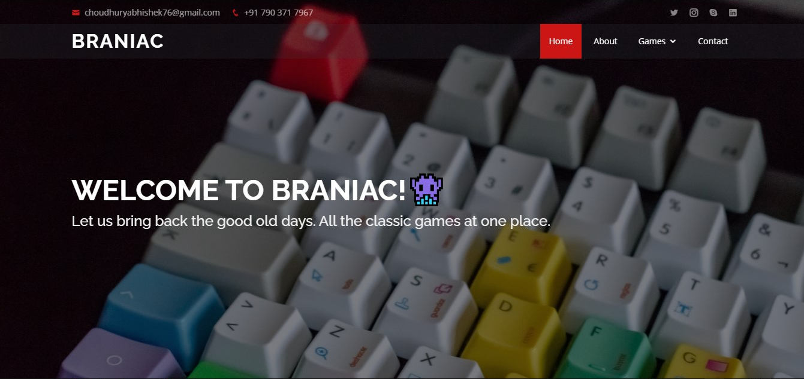

# Braniac
> The sole purpose of makng this website is to re make our own small games according to our flavour of choice. 

## Table of contents
* [General info](#general-info)
* [Screenshots](#screenshots)
* [Technologies](#technologies)
* [Setup](#setup)
* [Features](#features)
* [To-do list](#To-do-list)
* [Inspiration](#inspiration)
* [Contact](#contact)

## General info
We were working on a similar project where we can re create old 8 bit games and from there we got an idea to do it in HTML and Javascript.  At the same time we were having a college exhibition within our different departments. This project helped us going through the same.

## Screenshots

## Technologies
* HTML5
* CSS and Bootstrap for styling
* Javascript
* Google embedded games

## Setup
The whole project can be downloaded to the local system. Just the name of the directories needs to be changed according the user system. For eg: 
change yesabhishek\Desktop\Braniac\.. to User\Desktop\Braniac (User will be according to your username)

## Features
* At present we have added 4 Games, ready to play.
* The whole UI is kept minimal and easy to understand. 
* No ads or pop up are added as of now. 

## To-do list
* For future development, one can add new games to our project once we validate it. 
* We are looking for an in built chat service and multiplayer games where users can join from around the globe and play games and at the same time can chat with the other user.  

## Status
Project is in complete state as of now. Feel free to update the code which might be useful for the project. 

## Inspiration
We took help from different sources over the internet. The inspirtation was to remake the old games, most preferably 8 bit games but we could not actually achive that. So for that we added the embedded code inside our HTML. 

## Contact
Created by [@yesabhishek] - feel free to contact me!
Email: choudhuryabhishek76@gmail.com
